# Plano: GraphRAG com Neo4j, LangGraph e LangChain (projeto do zero)

## Contexto

A **abordagem GraphRAG (Microsoft)** envolve:

- **Indexação:** documentos → chunks (TextUnits) → extração de entidades/relacionamentos (LLM) → detecção de comunidades (ex.: Leiden) → resumos de comunidades (Community Reports) → embeddings (chunks, entidades, reports).
- **Query:** classificação em **busca local** (entidades específicas + grafo + texto) ou **busca global** (relatórios de comunidades, map-reduce); depois síntese da resposta.

Stack: **Neo4j** (grafo + índice vetorial), **LangChain** (LLM, embeddings, loaders, Cypher QA, retrievers), **LangGraph** (grafo de estados para o fluxo de query).

---

## Estrutura de pastas proposta

```
graphrag-neo4j-langchain/
├── src/graphrag/
│   ├── __init__.py
│   ├── config.py                 # Configuração (env, constantes)
│   ├── state.py                  # TypedDict do estado LangGraph
│   ├── prompts/                  # Prompts Cypher e síntese
│   │   ├── __init__.py
│   │   ├── cypher.py
│   │   └── synthesis.py
│   ├── chains/                   # Chains LangChain
│   │   ├── __init__.py
│   │   ├── router.py
│   │   ├── decompose.py
│   │   ├── retrieval.py
│   │   └── graph_qa.py
│   ├── graph/                    # Grafo LangGraph (nós + compilação)
│   │   ├── __init__.py
│   │   ├── nodes.py
│   │   └── query_graph.py
│   ├── indexing/                 # Pipeline de indexação GraphRAG
│   │   ├── __init__.py
│   │   ├── load_and_chunk.py
│   │   ├── extract_graph.py
│   │   ├── communities.py
│   │   ├── reports.py
│   │   └── embed.py
│   └── store/                    # Acesso Neo4j (grafo + índices vetoriais)
│       ├── __init__.py
│       ├── neo4j_graph.py
│       └── vector_index.py
├── scripts/
│   ├── run_indexing.py           # Executa pipeline de indexação
│   └── run_query.py              # CLI para perguntas (opcional)
├── main.py                       # Ponto de entrada: run_query(question)
├── requirements.txt
├── pyproject.toml
├── .env.example
└── README.md
```

---

## Arquitetura alvo

```mermaid
flowchart TB
  subgraph indexacao [Pipeline de indexação]
    D[Documentos] --> Chunk[Chunk TextUnits]
    Chunk --> Extract[Extrair entidades e relacionamentos]
    Extract --> Neo4jGraph[Neo4j grafo]
    Neo4jGraph --> Communities[Detecção comunidades]
    Communities --> Reports[Community Reports LLM]
    Reports --> Embed[Embeddings]
    Chunk --> Embed
    Embed --> Neo4jVec[Neo4j Vector Index]
  end
  subgraph query [Pipeline de query LangGraph]
    Q[Pergunta] --> Route[Router local vs global]
    Route --> Local[Busca local]
    Route --> Global[Busca global]
    Local --> LocalRetrieve[Entidades + Cypher + chunks]
    Global --> GlobalRetrieve[Community reports]
    LocalRetrieve --> Synthesize[Síntese final LLM]
    GlobalRetrieve --> Synthesize
    Synthesize --> Answer[Resposta]
  end
```




---

## Fase 1: Fundação do projeto e fluxo de query (do zero)

**Objetivo:** Criar a base do projeto (config, store Neo4j, state, prompts, chains) e o fluxo de query orquestrado por LangGraph (router → local ou global → síntese), sem depender de código pré-existente.

1. **Estrutura e dependências**
  - Criar `pyproject.toml` e `requirements.txt` com: `langchain`, `langchain-openai`, `langchain-community`, `langgraph`, driver Neo4j (`neo4j`). Definir pacote instalável em `src/graphrag` (layout `src/`).
  - Criar `.env.example` com `NEO4J_URI`, `NEO4J_USER`, `NEO4J_PASSWORD`, `OPENAI_API_KEY`.
2. **Config e store Neo4j**
  - `src/graphrag/config.py`: carregar variáveis de ambiente; expor constantes (URIs, nomes de índices).
  - `src/graphrag/store/neo4j_graph.py`: instanciar e expor `Neo4jGraph` (LangChain) a partir da config.
  - `src/graphrag/store/vector_index.py`: funções para obter/criar índices vetoriais Neo4j (ex.: `Neo4jVector`) para TextUnits, entidades e Community Reports; usar config para conexão.
3. **Estado LangGraph**
  - `src/graphrag/state.py`: definir `GraphRAGState` (TypedDict ou Annotated) com campos: `question`, `search_type` (Literal["local","global"]), `subqueries`, `context_docs`, `cypher_result`, `community_reports`, `final_answer`, e outros necessários ao fluxo.
4. **Prompts**
  - `src/graphrag/prompts/cypher.py`: prompt few-shot para geração de Cypher; opcionalmente `create_prompt_with_context(state)` que injeta contexto (ex.: documentos recuperados) no prompt do Cypher QA.
  - `src/graphrag/prompts/synthesis.py`: prompt para o nó de síntese (pergunta + contexto → resposta final).
5. **Chains LangChain**
  - `src/graphrag/chains/router.py`: chain que classifica a pergunta em **local** vs **global** (ex.: structured output com Literal["local","global"]); usar LLM + prompt adequado.
  - `src/graphrag/chains/decompose.py`: decomposição da pergunta em subqueries (ex.: uma para similaridade, outra para Cypher), com parser Pydantic.
  - `src/graphrag/chains/retrieval.py`: chain de retrieval (ex.: RetrievalQA) sobre o índice vetorial Neo4j de TextUnits (ou entidades), retornando documentos/ids para o state.
  - `src/graphrag/chains/graph_qa.py`: `GraphCypherQAChain` sobre `Neo4jGraph`, usando prompts de `prompts/cypher.py`; variante com contexto se necessário.
6. **Nós e grafo LangGraph**
  - `src/graphrag/graph/nodes.py`: implementar nós que recebem e retornam atualizações do state: `router`, `decompose`, `local_retrieve`, `graph_qa`, `synthesize`; para global, inicialmente `global_stub` que preenche `final_answer` com mensagem “global não implementado”.
  - `src/graphrag/graph/query_graph.py`: construir `StateGraph` com estado `GraphRAGState`; nó inicial **router** → condicional por `search_type` → ramo **local** (decompose → local_retrieve → graph_qa → synthesize) e ramo **global** (global_stub); nó final comum que lê `final_answer`. Compilar e expor `run_query(question: str) -> str`.
7. **Ponto de entrada**
  - `main.py` na raiz: carregar env (ex.: `python-dotenv`), chamar `run_query` com pergunta de exemplo ou argumento de linha de comando (opcional: `scripts/run_query.py` com CLI).

Com isso, o projeto nasce do zero com fluxo de query híbrido (local funcional, global em stub) orquestrado por LangGraph.

---

## Fase 2: Pipeline de indexação no estilo GraphRAG (Neo4j)

**Objetivo:** Popular Neo4j com entidades, relacionamentos, comunidades e community reports a partir de documentos, permitindo busca local (grafo + entidades) e global (reports).

1. **Modelo de dados no Neo4j**
  - Definir labels: `Document`, `TextUnit` (chunk), `Entity`, `Relationship`, `Community`, `CommunityReport`.
  - Propriedades principais: em entidades (nome, tipo, descrição, embedding opcional); em CommunityReport (conteúdo do resumo, nível hierárquico, embedding para busca global). Relações: Document → TextUnit; TextUnit → Entity/Relationship; Entity ↔ Relationship; Community → Entity; Community → CommunityReport.
2. **Pipeline de indexação em `src/graphrag/indexing/`**
  - **load_and_chunk.py:** LangChain document loaders + text splitters; criar nós `Document` e `TextUnit` no Neo4j e ligar Document → TextUnit.
  - **extract_graph.py:** Por cada TextUnit (ou em batch), usar LLM (LangChain) para extrair entidades e relacionamentos (schema fixo: tipo/nome/descrição; origem/destino/descrição). Inserir `Entity` e `Relationship` no Neo4j e ligar ao TextUnit de origem.
  - **communities.py:** Exportar grafo de entidades/relacionamentos para Python (ou usar Neo4j GDS se disponível). Rodar detecção de comunidades (ex.: Leiden via `igraph` ou `networkx`); persistir nós `Community` e relações ENTITY_IN_COMMUNITY.
  - **reports.py:** Por comunidade, gerar resumo com LLM do subgrafo da comunidade; criar nós `CommunityReport` e ligar à `Community`.
  - **embed.py:** Gerar embeddings para TextUnits, descrições de entidades e conteúdo dos Community Reports; escrever nos índices vetoriais Neo4j (usar `store/vector_index.py`).
3. **Configuração do pipeline**
  - Parâmetros em `config.py` ou YAML/env: tamanho e overlap do chunk, modelo LLM, modelo de embedding, limites de comunidade. Um único ponto de config para Neo4j (URI, user, password).
4. **Script de execução**
  - `scripts/run_indexing.py`: orquestrar o pipeline (load → extract → communities → reports → embed) sobre um diretório ou lista de ficheiros de entrada.

---

## Fase 3: Busca local e global no fluxo LangGraph

**Objetivo:** Implementar busca local (entidades + Cypher + chunks) e global (community reports) completas no mesmo StateGraph.

1. **Busca local (refinamento)**
  - No nó de retrieval local: a partir da pergunta, identificar entidades relevantes (LLM ou busca por similaridade nas descrições de entidades no Neo4j). Recuperar vizinhança no grafo (Cypher), relacionamentos e TextUnits ligados; preencher `context_docs` e `cypher_result` no state para o nó `synthesize`.
2. **Busca global**
  - Nó **global_retrieve:** embedding da pergunta → busca por similaridade nos Community Reports (índice vetorial Neo4j); top-k reports → preencher `community_reports` no state.
  - Nó **global_synthesize:** LLM com pergunta + textos dos reports (map-reduce opcional) → preencher `final_answer`.
3. **Router**
  - Ajustar `chains/router.py` para classificar **local** vs **global** (ex.: “temas principais”, “visão geral”, “tendências” → global; entidade específica → local). No `query_graph.py`, dois ramos: local (decompose → local_retrieve → graph_qa → synthesize) e global (global_retrieve → global_synthesize).
4. **Unificação**
  - State com campos comuns `question`, `final_answer`, `search_type`; nó final único que lê `final_answer` de qualquer ramo. Manter um único ponto de entrada `run_query(question)`.

---

## Resumo de artefatos (estrutura do zero)


| Artefato                              | Descrição                                                            |
| ------------------------------------- | -------------------------------------------------------------------- |
| `src/graphrag/config.py`              | Configuração (env, constantes)                                       |
| `src/graphrag/state.py`               | Estado LangGraph (search_type, context, final_answer, etc.)          |
| `src/graphrag/store/`                 | Neo4j graph + índices vetoriais (TextUnits, entities, reports)       |
| `src/graphrag/prompts/`               | Prompts Cypher (few-shot, com contexto) e síntese                    |
| `src/graphrag/chains/`                | router, decompose, retrieval, graph_qa                               |
| `src/graphrag/graph/nodes.py`         | Nós do fluxo (router, local, global, synthesize)                     |
| `src/graphrag/graph/query_graph.py`   | StateGraph compilado e `run_query()`                                 |
| `src/graphrag/indexing/`              | Pipeline: load_and_chunk, extract_graph, communities, reports, embed |
| `scripts/run_indexing.py`             | Execução do pipeline de indexação                                    |
| `main.py`                             | Entrada para `run_query` e env                                       |
| `requirements.txt` / `pyproject.toml` | Dependências                                                         |
| `.env.example`                        | NEO4J_*, OPENAI_API_KEY                                              |


---

## Ordem de implementação sugerida

1. Estrutura do projeto: `pyproject.toml`, `requirements.txt`, `.env.example`, árvore `src/graphrag/` com `__init__.py` e módulos vazios ou stubs.
2. Config, store Neo4j (grafo + vector index) e state; em seguida prompts e chains (router, decompose, retrieval, graph_qa).
3. Nós e `query_graph.py`; ramo local completo e stub global; `main.py`; testar fluxo local.
4. (Fase 2) Pipeline de indexação em `indexing/` e `scripts/run_indexing.py`; popular Neo4j e validar índices.
5. (Fase 3) Implementar global_retrieve e global_synthesize; ajustar router para local vs global; unificar resposta em `run_query`.

O plano descreve a criação do projeto do zero, sem referência à estrutura de pastas ou ao código existente no repositório.